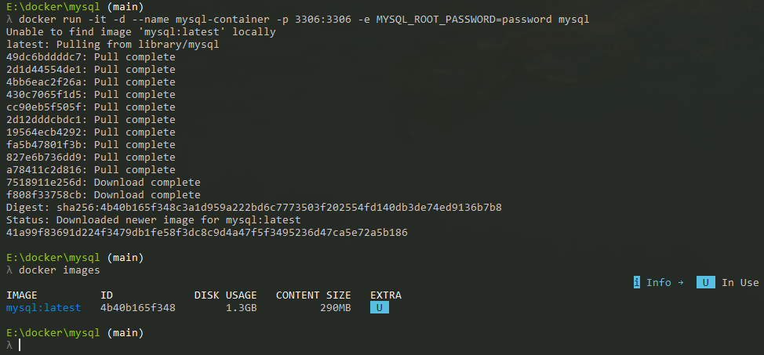
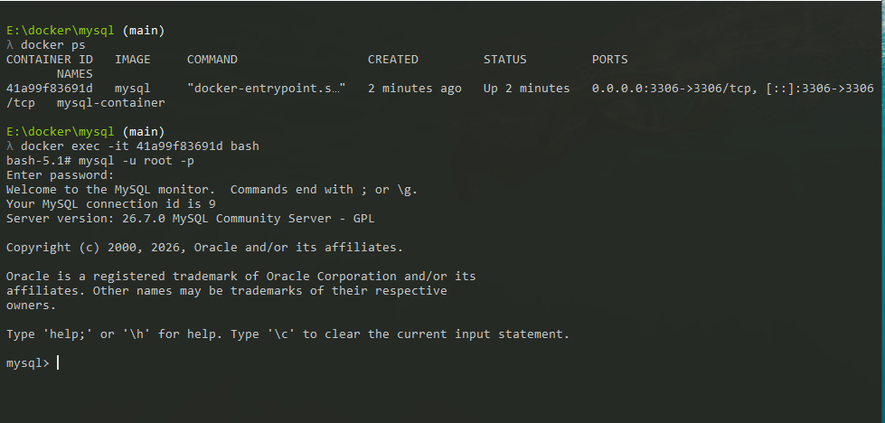

# docker

## 1.runing flask_server

```bash
docker built -t 'image name' 'dockerfile path'
docker built -t flask_server .

docker run -it -d -p host_port:docker_port 'image name'
docker run -it -d -p 8000:8000 flask_server
```
## 2.volumes
## docker volumes store in /var/lib/docker/volume
```bash
docker volume create <volume name>
docker run -it -d --name <container name> -v <volume name>:<where this volume will mount in container> 
``` 
## 3. mysql
### 1- start mysql container



### 2- interact with container cli



## 4. run sql with volume to save data after deleting container

```sh
docker run -it -d --name mysql-container -p 3306:3306 -v mysql-volume:/var/lib/mysql -e MYSQL_ROOT_PASSWORD=password mysql
```

